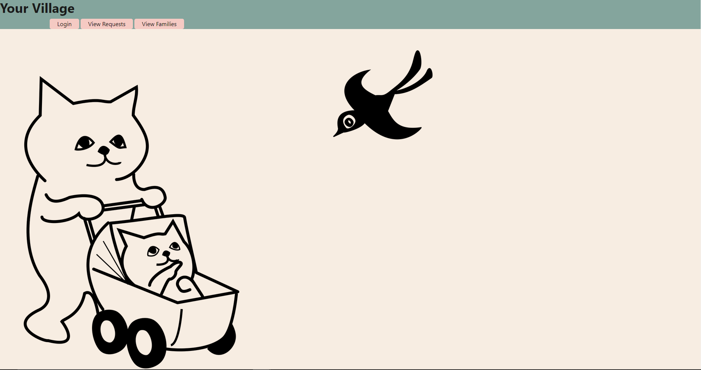
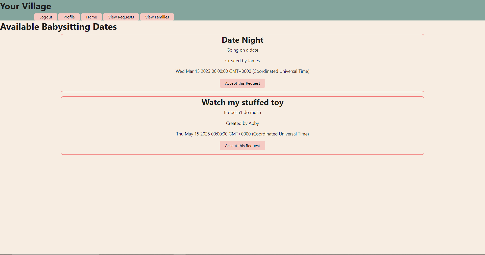

# Team-Team# Village: The Neighborhood Babysitting App
 ## README Section Links
  * [Description/Usage](#description)
  * [Licenses](#licenses)
  * [Deployed Application](#deployed)
  * [Screenshots](#screenshot)
  * [Credits/questions](#credits)

## Description/Usage
    Village is a Babysitting sitting app to conievently allow parents have other to parents within their neighborhood watch their kids. Instead of worring about selecting someone you've never met before to watch your kids and spend alot of money on it, this app allows parents around the neighborhood to pitch in and babysit each others children when needed. The idea is simple, sign up for the app which would be based locally, and you can make request for other members to 
    watch your kid as well as take up request from other parents. Since the idea is give and take, and x's out the need to spend money, the ability to make requests will be based on a credit system. You need a credit to be able to make requests for your children to be watched, and you gain credits by taking requests from other parents. When making a request you title, specify a date,
    and write a comment for specifics about the request.

## Technologies Used
    We used nodemailer to handle sending out emails when requests are accepted. 

## Licenses
    MIT
## Deployed Application
    https://enigmatic-basin-06766.herokuapp.com/
## Screenshots

   

## Credits/questions
    GitHub: https://github.com/connorg24

    other github go here